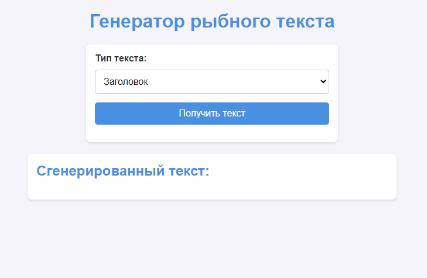
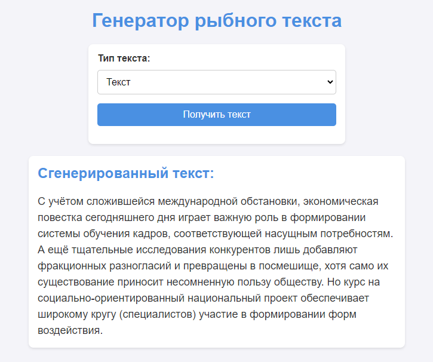

# Генератор рыбного текста

## Описание проекта

Этот проект реализует генератор рыбного текста с использованием API [FishText](https://fish-text.ru). Пользователь может выбрать тип текста (заголовок или текст), отправить запрос и получить сгенерированный результат. Состояние текста сохраняется в LocalStorage, чтобы после перезагрузки страницы текст не терялся.

## Функциональность

- **Выбор типа текста**: Заголовок или обычный текст.
- **Получение текста через API**: Используется асинхронный запрос (`fetch`).
- **Сохранение состояния**: Последний сгенерированный текст сохраняется в LocalStorage.
- **Восстановление состояния**: После перезагрузки страницы текст отображается автоматически.
- **Взаимодействие с DOM**: Динамическое обновление текста на странице.
- **Обработчики событий**:
    - `submit` — для отправки формы.
    - `load` — для восстановления текста при загрузке страницы.

## Стек технологий

- HTML
- CSS
- JavaScript

## Как использовать

1. Откройте проект в браузере.
2. Выберите тип текста в выпадающем меню.
3. Нажмите кнопку "Получить текст".
4. Сгенерированный текст отобразится на странице и сохранится.
5. При перезагрузке страницы текст будет автоматически восстановлен.

## Установка и запуск

1. Склонируйте репозиторий:
   ```bash
   git clone https://github.com/Wimhad/Native-JS.git
   ```
2. Откройте файл `index.html` в браузере.

## Развёртывание

Проект развернут на GitHub Pages и доступен по ссылке:  
[Fish Text Generator](https://wimhad.github.io/Native-JS/)

## Скриншоты

### Главный экран:


### Пример сгенерированного текста:


## Автор

Аддахи Виссам, 2024
